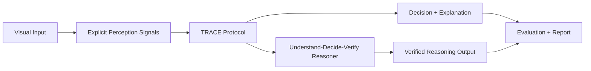
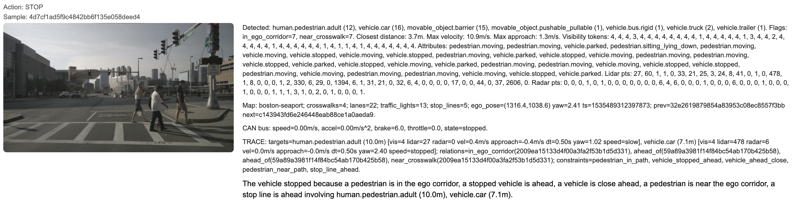
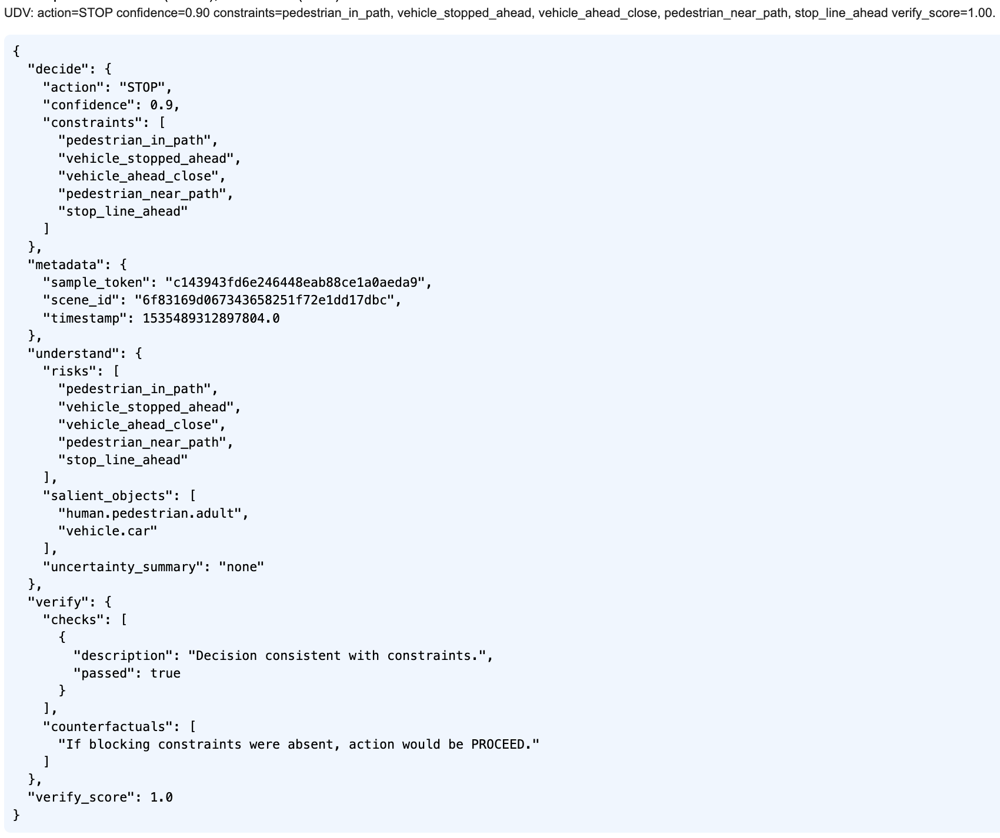
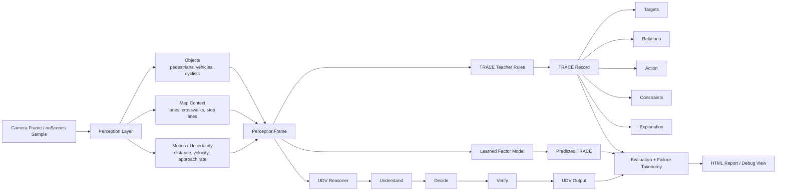

# AV Perception TRACE

An observable perception–reasoning system for autonomous driving that produces
structured decision traces and interpretable explanations.

## Overview

Modern autonomous driving systems can predict actions, but often lack transparency in
why those actions were taken.

This project introduces a structured protocol for perception-driven reasoning:

- **TRACE** — Targets, Relations, Action, Constraints, Explanation
- **UDV** — Understand → Decide → Verify reasoning loop

The system explicitly represents:
- what the vehicle perceives,
- which risks matter,
- how decisions are made,
- and how those decisions can be verified.

## Key Idea

Instead of:

```
image → black-box model → action
```

We build:

```
image → perception signals → structured reasoning (TRACE) → decision → explanation
```

Explanations are derived from structured reasoning, not generated post-hoc.

## High-Level System



TRACE acts as the observability contract between perception, learned reasoning,
decision-making, and explanation generation.

## Example Output (TRACE)

```json
{
  "targets": ["pedestrian_3"],
  "relations": ["in_ego_corridor"],
  "action": {"type": "STOP", "confidence": 0.9},
  "constraints": ["pedestrian_in_path"],
  "explanation": "The vehicle stopped because a pedestrian was detected in the ego corridor."
}
```

## Example Output (UDV)

```json
{
  "understand": {
    "salient_objects": ["pedestrian_3"],
    "risks": ["pedestrian_crossing"],
    "uncertainty": "low"
  },
  "decide": {
    "action": "STOP",
    "confidence": 0.88
  },
  "verify": {
    "checks": ["pedestrian_in_path → STOP"],
    "counterfactuals": [
      "If no pedestrian were present, action would be PROCEED"
    ]
  }
}
```

## Sample Visuals

Add two example images (report screenshot, overlay) by placing files in `docs/images/`
and updating the paths below.




## Failure Case Example

CAN bus indicates `proceeding`, but TRACE/UDV decide to `STOP` for sample
`b26e791522294bec90f86fd72226e35c`.

TRACE (truncated):
```json
{
  "metadata": {
    "sample_token": "b26e791522294bec90f86fd72226e35c"
  },
  "action": {
    "type": "STOP",
    "confidence": 0.9
  },
  "can_bus": {
    "motion_state": "proceeding",
    "vehicle_speed_mps": 15.55,
    "accel_mps2": 0.74,
    "brake": 0.0,
    "throttle": 79.0
  },
  "constraints": [
    "pedestrian_in_path",
    "pedestrian_close_near_crosswalk",
    "closing_on_vehicle_ahead",
    "vehicle_ahead_close",
    "pedestrian_near_path",
    "stop_line_ahead"
  ],
  "targets": [
    "human.pedestrian.construction_worker (9.2m)",
    "human.pedestrian.adult (4.6m)",
    "vehicle.motorcycle (12.2m)",
    "vehicle.construction (11.2m)"
  ]
}
```

UDV (truncated):
```json
{
  "decide": {
    "action": "STOP",
    "confidence": 0.9,
    "constraints": [
      "pedestrian_in_path",
      "pedestrian_close_near_crosswalk",
      "closing_on_vehicle_ahead",
      "vehicle_ahead_close",
      "pedestrian_near_path",
      "stop_line_ahead"
    ]
  },
  "verify": {
    "checks": [
      {
        "description": "Decision consistent with constraints.",
        "passed": true
      }
    ],
    "counterfactuals": [
      "If blocking constraints were absent, action would be PROCEED."
    ]
  },
  "verify_score": 1.0
}
```

Analysis:
- CAN bus shows the ego vehicle proceeding despite a STOP decision
- multiple close pedestrians + stop line constraints overrode motion cues
- highlights how conservative rules can conflict with actual motion state

## System Structure

```
src/
  data/            # schemas + nuScenes loader
  perception/      # feature extraction + uncertainty
  trace_protocol/  # TRACE types, builders, validators
  teacher/         # deterministic rules (ground truth reasoning)
  models/          # learned factor model
  udv/             # UDV reasoning + verification
  eval/            # metrics + failure taxonomy
scripts/           # runnable pipelines
docs/              # design documentation
```

## Pipeline

One-shot pipeline (recommended):
```
python scripts/run_all.py \
  --dataset-root data/v1.0-mini \
  --limit 120 \
  --report-limit 120
```

This runs:
- perception frame generation
- TRACE generation (teacher rules)
- evaluation summary
- HTML report generation

Optional: include UDV reasoning:
```
python scripts/run_all.py --run-udv --udv-output data/udv_outputs.jsonl
```

## Architecture



## Outputs

TRACE logs:
- structured reasoning for every frame
- fully auditable decision pipeline

HTML report:
- visual + structured debugging interface
- action, perception context, constraints, explanations

Evaluation summary:
- action distribution
- constraint frequency
- failure taxonomy
- confidence statistics

## Individual Components

Generate perception frames:
```
PYTHONPATH=src python scripts/run_infer.py \
  --dataset-root data/v1.0-mini \
  --limit 50 \
  --output data/perception_frames.jsonl
```

Generate TRACE (teacher rules):
```
PYTHONPATH=src python scripts/run_teacher.py \
  --input data/perception_frames.jsonl \
  --output data/teacher_traces.jsonl \
  --limit 50
```

Evaluate:
```
PYTHONPATH=src python scripts/run_eval.py \
  --traces data/teacher_traces.jsonl
```

Render report:
```
PYTHONPATH=src python scripts/render_report.py \
  --frames data/perception_frames.jsonl \
  --traces data/teacher_traces.jsonl \
  --output data/report.html
```

Learned reasoning (factor model) training:
```
PYTHONPATH=src python scripts/run_train_factors.py
```

Learned reasoning (factor model) inference:
```
PYTHONPATH=src python src/models/infer.py \
  --frames data/perception_frames.jsonl \
  --model data/factor_model.pkl \
  --output data/factor_traces.jsonl
```

Evaluate vs teacher:
```
PYTHONPATH=src python scripts/evaluate_factor.py \
  --teacher data/teacher_traces.jsonl \
  --factor data/factor_traces.jsonl
```

## Report Interpretation Guide

Each card corresponds to one frame:
- **Action**: TRACE action chosen by deterministic teacher rules.
- **Detected**: object counts and context (closest distance, velocity, approach rate).
- **Map**: lanes/crosswalks/stop lines and ego pose, if available.
- **CAN bus**: speed/accel/brake/throttle and derived `motion_state`.
- **TRACE**: targets/relations/constraints that justified the action.
- **UDV** (optional): deterministic UDV output with `verify_score`.

Summary section:
- **Action distribution**: counts of STOP/SLOW/PROCEED.
- **Top constraints**: most frequent constraint types.
- **TRACE coverage**: percent of traces with targets/relations/constraints.
- **Confidence**: min/avg/max action confidence.
- **Failure taxonomy**: heuristic error tags for quick review.

## Design Goals

- make perception explicit and structured
- ensure reasoning is observable and auditable
- support failure analysis, not just prediction
- bridge deterministic rules → learned reasoning → LLM-based reasoning

## Future Work

- lightweight LLM for structured UDV reasoning
- temporal reasoning (multi-frame context)
- counterfactual reasoning for safety validation
- improved uncertainty modeling

## Summary

This project treats perception as a contract between sensing and decision-making. By
enforcing structured reasoning (TRACE) and verifiable decision loops (UDV), it
demonstrates how autonomous systems can remain interpretable even when learning-based
components are introduced.

## Heuristic perception flags (current)
The loader assigns simple distance-based flags for pedestrians and cyclists:
- Label mapping: `human.pedestrian.*` -> `pedestrian`, `vehicle.bicycle`/`vehicle.motorcycle` -> `cyclist`
- `in_ego_corridor`: distance <= 12.0 m
- `near_crosswalk`: distance <= 20.0 m

Or run them all at once:
```
python scripts/run_all.py
```

## Sanity check report
Render a simple HTML page with images + explanations:
```
python scripts/render_report.py --limit 20
```
Open `data/report.html` in your browser.

To render images with nuScenes 3D boxes overlaid:
```
python scripts/render_report.py --limit 20 --overlay --dataset-root data
```
